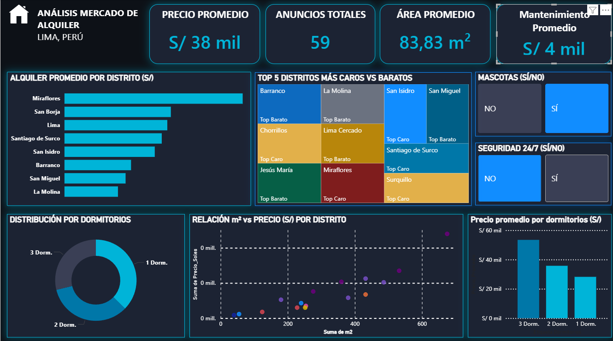

# 🏠 Análisis del Mercado de Alquiler — Lima Metropolitana

<div align="center">


**Dashboard interactivo sobre el mercado de alquiler de departamentos en Lima, Perú.**  
Datos extraídos de Urbania · Abril 2026

</div>

---

## 📌 Descripción

Este proyecto analiza **368 registros de anuncios de alquiler** en Lima Metropolitana, scrapeados de Urbania en abril de 2026. A través de un dashboard en Power BI, se identifican patrones de precios, distribución geográfica e impacto de amenidades, con enfoque en la toma de decisiones para arrendatarios, propietarios e inversores inmobiliarios.

> ⚠️ **Nota metodológica:** el dataset crudo contiene registros duplicados por paginación del scraper. El archivo contiene **94 IDs únicos** sobre 368 filas totales. Los promedios y KPIs se calculan sobre el dataset crudo; para análisis inferencial se recomienda deduplicar por `ID_Anuncio`.

---

## 📊 Vista previa del dashboard



### Visuals incluidos

| Visual | Descripción |
|---|---|
| 4 KPI Cards | Precio promedio · Total anuncios · Área promedio · Mantenimiento promedio |
| Barras horizontales | Precio promedio de alquiler por distrito |
| Treemap | Top 5 distritos más caros vs más económicos |
| Gráfico de anillos | Distribución de anuncios por número de dormitorios |
| Scatter plot | Relación entre área (m²) y precio mensual por distrito |
| Columnas agrupadas | Precio promedio por número de dormitorios |
| Slicers | Filtros interactivos: mascotas permitidas · seguridad 24/7 |

---

## 📈 KPIs principales

> Calculados sobre el dataset crudo (368 filas).

| Indicador | Valor |
|---|---|
| Total de anuncios | **368** (94 únicos) |
| Precio promedio mensual | **S/ 4,987** |
| Precio ponderado por m² | **S/ 40.45 / m²** |
| Mantenimiento promedio | **S/ 454** (9.1% del alquiler) |
| Diferencial pet-friendly | **−26.64%** |

---

## 🗺️ Precios promedio por distrito

| Distrito | Precio promedio | Anuncios |
|---|---:|---:|
| Chorrillos | S/ 8,500 | 3 |
| Miraflores | S/ 5,780 | 190 |
| San Isidro | S/ 5,440 | 57 |
| Santiago de Surco | S/ 4,748 | 19 |
| Surquillo | S/ 3,955 | 11 |
| Magdalena | S/ 3,777 | 8 |
| Lince | S/ 3,734 | 19 |
| Carabayllo | S/ 3,500 | 2 |
| San Borja | S/ 3,481 | 2 |
| Lima | S/ 3,365 | 4 |
| Barranco | S/ 3,108 | 16 |
| Jesús María | S/ 2,877 | 13 |
| Lima Cercado | S/ 2,550 | 8 |
| San Miguel | S/ 2,006 | 15 |
| La Molina | S/ 1,750 | 1 |

---

## 💡 Insights clave

### 1. Miraflores concentra más del 50% de la oferta
Con 190 de 368 anuncios (51.6%) y precio promedio de S/ 5,780, Miraflores domina tanto en volumen como en nivel de precio. Esto puede sesgar los promedios generales del mercado.

### 2. San Isidro confirma su posición como polo premium
Con 57 anuncios y S/ 5,440 de precio promedio, San Isidro es el segundo mercado de alquiler alto en Lima. Junto a Miraflores concentran el **67.7% de toda la oferta analizada**.

### 3. El precio por m² es el KPI más justo para comparar
El indicador ponderado de **S/ 40.45/m²** elimina el sesgo por tamaño del inmueble, permitiendo comparaciones entre estudios, departamentos medianos y penthouses en igualdad de condiciones.

### 4. El salto de 2 a 3 dormitorios es el cambio de precio más fuerte

| Dormitorios | Precio prom. | Variación |
|---|---:|---:|
| 1 dorm | S/ 3,011 | — |
| 2 dorm | S/ 3,559 | +18% |
| 3 dorm | S/ 5,263 | **+48%** |
| 4 dorm | S/ 6,260 | +19% |

El segmento de 3 dormitorios marca la transición al mercado familiar y representa el mayor salto de precio relativo.

### 5. Los depas pet-friendly son 26.6% más baratos en promedio
Este diferencial **no indica causalidad**: los departamentos que permiten mascotas se concentran en distritos más económicos (Jesús María, San Miguel, Lince). Es una correlación geográfica, no un descuento por permitir mascotas.

### 6. El mantenimiento es un costo oculto relevante
El mantenimiento promedio de S/ 454 equivale al **9.1% del alquiler mensual**. En Miraflores y San Isidro este costo puede superar los S/ 600 mensuales y debe incluirse en el presupuesto total del arrendatario.

---

## 🔧 Medidas DAX

```dax
-- Precio promedio mensual
Precio_Promedio = AVERAGE('alquileres_lima_crudo'[Precio_Soles])

-- Total de anuncios (con y sin deduplicar)
Total_Anuncios        = COUNTROWS('alquileres_lima_crudo')
Total_Anuncios_Unicos = DISTINCTCOUNT('alquileres_lima_crudo'[ID_Anuncio])

-- KPI principal: precio ponderado por m²
Precio_Ponderado_m2 =
DIVIDE(
    SUM('alquileres_lima_crudo'[Precio_Soles]),
    SUMX(
        FILTER('alquileres_lima_crudo', ISNUMBER(VALUE('alquileres_lima_crudo'[m2]))),
        VALUE('alquileres_lima_crudo'[m2])
    )
)

-- Mantenimiento promedio mensual
Avg_Mantenimiento =
AVERAGEX(
    FILTER('alquileres_lima_crudo', ISNUMBER(VALUE('alquileres_lima_crudo'[Mantenimiento]))),
    VALUE('alquileres_lima_crudo'[Mantenimiento])
)

-- Precio total promedio (alquiler + mantenimiento)
Precio_Total_Promedio =
AVERAGEX(
    FILTER('alquileres_lima_crudo', ISNUMBER(VALUE('alquileres_lima_crudo'[Precio_Total_Soles]))),
    VALUE('alquileres_lima_crudo'[Precio_Total_Soles])
)

-- Diferencial pet-friendly
Premio_Pet_Friendly_% =
VAR precio_sin = CALCULATE([Precio_Promedio], 'alquileres_lima_crudo'[Mascotas] = 0)
VAR precio_con = CALCULATE([Precio_Promedio], 'alquileres_lima_crudo'[Mascotas] = 1)
RETURN DIVIDE(precio_con - precio_sin, precio_sin)
```

---

## ⚠️ Limitaciones del análisis

| Limitación | Recomendación |
|---|---|
| Dataset con duplicados por paginación | Deduplicar por `ID_Anuncio` para análisis inferencial |
| Miraflores sobrerepresentado (51.6%) | Reportar medianas además de promedios |
| Columnas numéricas almacenadas como texto | Corregir tipos en Power Query antes de escalar el modelo |
| Valores atípicos en dormitorios (7, 9, 10) | Filtrar a ≤ 5 dormitorios en los visuales del dashboard |
| Diferencial pet-friendly es correlación, no causalidad | No interpretar como efecto directo de la política de mascotas |

---

## 🗂️ Estructura del repositorio

```
📦 analisis-alquiler-lima/
├── 📄 README.md
├── 📁 dashboard/
│   ├── alquiler lima.pbix        # Archivo Power BI Desktop
│   └── Dashboard-imagen.png      # Captura del dashboard                 
├── 📁 excel/                     # Exportaciones y análisis auxiliares
└── 📁 scrapping/
    ├── alquileres_lima_crudo.csv  # Dataset original scrapeado
    └── scraper_inmobiliario.py   # Script de scraping con Scrapy
```

---

## 🎨 Paleta de colores del dashboard

| Elemento | Hex |
|---|---|
| Fondo del lienzo | `#0D1117` |
| Fondo de tarjetas | `#1C2333` |
| Color principal (cian) | `#00B4D8` |
| Color acento (dorado) | `#E2B04A` |
| Barras neutras | `#3A3F55` |
| Texto secundario | `#8899AA` |

---

## 🛠️ Tecnologías utilizadas

- **Power BI Desktop** v2.153.910.0 (abril 2026)
- **DAX** — medidas y KPIs calculados
- **Python + Scrapy** — scraping de datos desde Urbania

---

## 📬 Contacto

¿Tienes preguntas, sugerencias o encontraste algún error?  
Abre un **issue** en este repositorio.

---

<div align="center">
<sub>Datos extraídos con fines académicos y de análisis de mercado · Lima, Perú · Abril 2026</sub>
</div>
