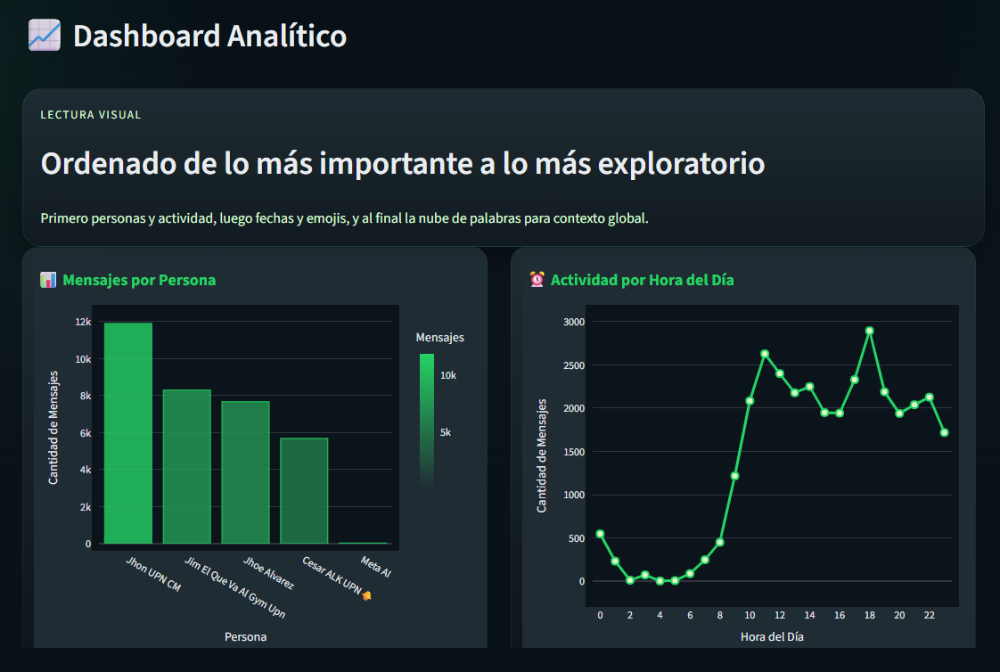
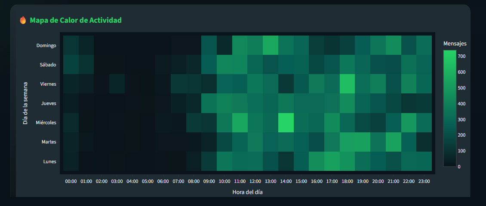
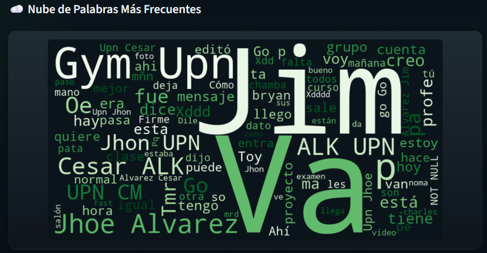

# 💬 Chatlyzer — WhatsApp Chat Analytics Dashboard

Aplicación web desarrollada con **Streamlit** para analizar conversaciones exportadas de **WhatsApp**, generando métricas, visualizaciones interactivas e insights conversacionales a partir de archivos `.txt`.

La herramienta procesa los chats **100% localmente**, preservando la privacidad del usuario mientras transforma conversaciones en analítica visual accionable.

---

## 📸 Vista Previa

### Dashboard Principal



### Heatmap de Actividad



### Nube de Palabras



---

## 📌 Objetivo del Proyecto

Construir una herramienta de análisis conversacional que permita transformar exportaciones de WhatsApp en dashboards visuales e insights estadísticos para explorar patrones de comunicación, actividad y lenguaje.

---

## ✨ Funcionalidades

* Dashboard visual inspirado en **WhatsApp Web Dark Mode**
* Métricas clave de conversación y participación
* Ranking de mensajes por participante
* Distribución de actividad por hora del día
* Heatmap de actividad por día/hora
* Evolución temporal de mensajes por día
* Top emojis más utilizados
* Nube de palabras con términos frecuentes
* Exportación de chat limpio a CSV
* Exportación de resumen analítico a JSON
* Procesamiento completamente local y privado

---

## 📊 Insights Generados

La aplicación permite identificar:

* Participante más activo en la conversación
* Horarios pico de actividad
* Días con mayor interacción
* Frecuencia y distribución de emojis
* Temas/palabras predominantes
* Tendencia de actividad conversacional en el tiempo

---

## 🛠 Stack Tecnológico

`Python` `Streamlit` `Pandas` `Plotly` `WordCloud` `Regex`

---

## 📂 Estructura del Proyecto

```text id="chatlyzerstruct"
chatlyzer/
├── app.py
├── requirements.txt
├── README.md
├── config/
├── utils/
├── components/
├── ai/
└── images/
```

---

## ⚙️ Instalación

```bash id="chatinstall"
pip install -r requirements.txt
```

---

## ▶️ Ejecución

```bash id="chatrun"
streamlit run app.py
```

Luego abre:

```text id="chaturl"
http://localhost:8501
```

---

## 📱 Cómo Exportar un Chat de WhatsApp

1. Abrir el chat en WhatsApp
2. Seleccionar **Exportar Chat**
3. Elegir **Sin Multimedia**
4. Guardar archivo `.txt`
5. Subir archivo en la aplicación

---

## 🔄 Flujo de Uso

1. Subir archivo `.txt` exportado de WhatsApp
2. Procesamiento automático y limpieza de datos
3. Generación de dashboard analítico
4. Exploración de métricas y gráficos
5. Exportación opcional de resultados

---

## 🔒 Privacidad

* Procesamiento 100% local
* No se almacenan conversaciones
* No existe backend de persistencia
* Ningún dato es enviado a servidores externos

---

## 🚀 Casos de Uso

Este proyecto puede utilizarse como base para:

* Herramientas de análisis conversacional
* Dashboards de comportamiento social
* Proyectos de NLP / Text Mining
* Análisis exploratorio de texto
* Portafolios de Data Analytics / Data Science

---

## 📚 Arquitectura Adicional

Consulta:

**[README_ESTRUCTURA.md](README_ESTRUCTURA.md)**
para detalles técnicos de arquitectura y organización interna del proyecto.

---

## 📜 Licencia

MIT License

---

<div align="center">

**Desarrollado con ❤️ usando Streamlit**

</div>
