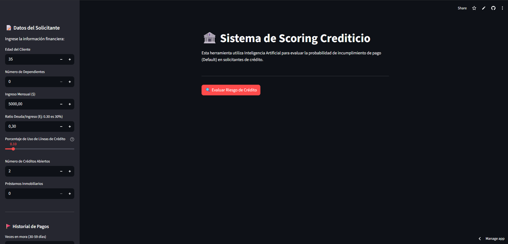
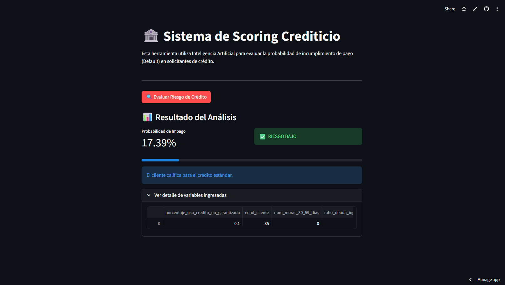

# 💳 Credit Scoring Machine Learning

Aplicación web de **Credit Scoring** desarrollada con **Streamlit** que estima el riesgo de impago de un solicitante utilizando un modelo de **Machine Learning** previamente entrenado.

La herramienta permite ingresar variables financieras y de comportamiento crediticio para predecir la **probabilidad de default** y clasificar automáticamente al cliente según su nivel de riesgo.

---

## 📸 Vista Previa de la Aplicación

### Dashboard Principal



### Resultado de Predicción



---

## 📌 Objetivo del Proyecto

Construir una solución interactiva de scoring crediticio que permita simular la evaluación de solicitantes financieros mediante analítica predictiva, replicando un flujo simplificado de evaluación de riesgo bancario.

---

## 🚀 Funcionalidades

* Interfaz web interactiva construida con **Streamlit**
* Captura estructurada de variables del solicitante mediante formulario lateral
* Predicción de probabilidad de impago con modelo de clasificación entrenado
* Segmentación automática del riesgo en **Bajo / Medio / Alto**
* Visualización del score mediante métricas, alertas y barra de progreso
* Panel técnico expandible con detalle de variables ingresadas

---

## 📊 Variables de Entrada

El modelo evalúa variables financieras y de comportamiento como:

* Edad del cliente
* Número de dependientes
* Ingreso mensual
* Ratio deuda / ingreso
* Utilización de crédito
* Créditos abiertos
* Préstamos inmobiliarios activos
* Historial de morosidad por rango de días

---

## 🧠 Enfoque de Machine Learning

* Modelo serializado en formato `.pkl`
* Inferencia en tiempo real desde interfaz web
* Clasificación basada en umbral de negocio configurable
* Arquitectura preparada para integración con pipelines de scoring productivos

---

## 🛠 Stack Tecnológico

`Python` `Streamlit` `Scikit-learn` `Pandas` `Pickle`

---

## 📂 Estructura del Proyecto

```text id="projstruct1"
.
├── app.py
├── modelo_riesgo_credito.pkl
├── requirements.txt
├── README.md
└── images/
    ├── dashboard-main.png
    └── prediction-result.png
```

---

## ⚙️ Instalación

```bash id="installcs"
pip install -r requirements.txt
```

---

## ▶️ Ejecución

```bash id="runstreamlit"
streamlit run app.py
```

La aplicación se abrirá automáticamente en el navegador local.

---

## 🔄 Flujo de Uso

1. Ejecutar la aplicación
2. Ingresar datos del solicitante
3. Presionar botón de evaluación
4. Revisar probabilidad de default y nivel de riesgo generado

---

## 📈 Caso de Uso

Este proyecto demuestra cómo integrar un modelo de **Machine Learning** dentro de una interfaz de negocio para apoyar procesos de evaluación financiera.

Aplicable como base para:

* Prototipos FinTech
* Sistemas internos de scoring bancario
* Dashboards de riesgo crediticio
* Portafolios de Data Science / ML Engineering

---

## 📌 Consideraciones Técnicas

* El modelo debe coincidir con el esquema de variables esperado por la aplicación
* El archivo `modelo_riesgo_credito.pkl` debe estar en la raíz del proyecto
* El umbral de clasificación puede ajustarse según política de riesgo de negocio

---
