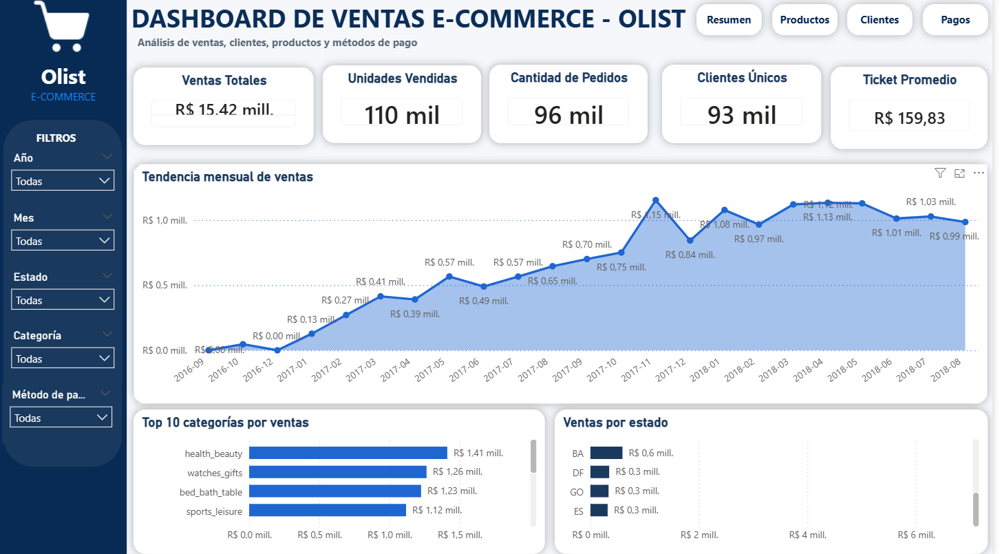
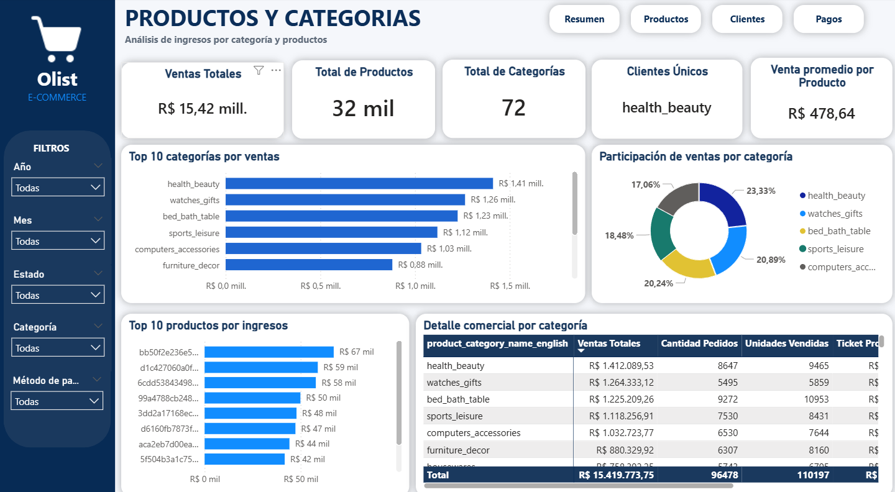
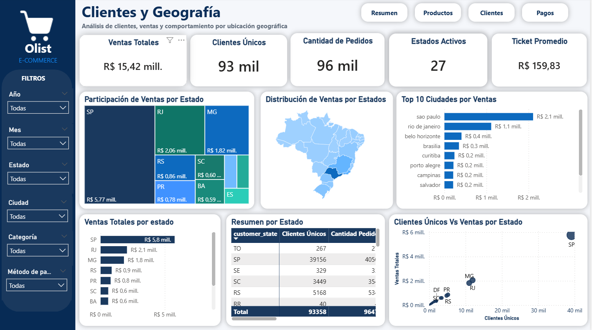
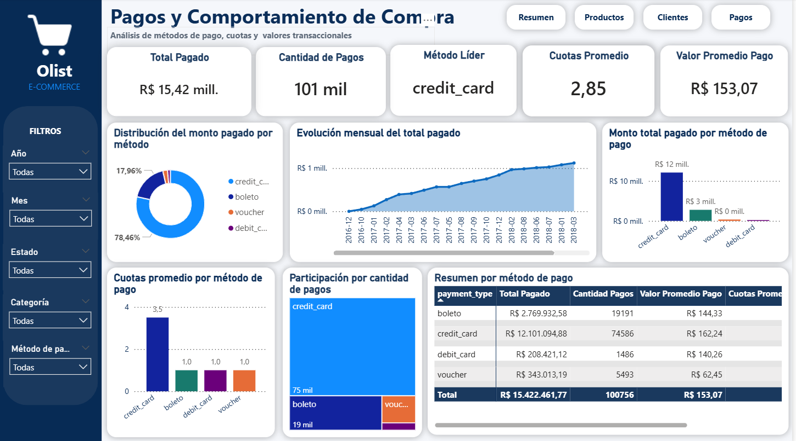

# Dashboard E-commerce Brasil 🇧🇷  
### Análisis de ventas, clientes, productos y pagos · SQL Server + Power BI · Dataset Olist


---

## Descripción

Dashboard interactivo desarrollado con **SQL Server, Power BI y DAX** para analizar el comportamiento comercial de un e-commerce brasileño utilizando el dataset público de **Olist**.

El proyecto integra información de ventas, clientes, productos, ubicación geográfica y métodos de pago, permitiendo identificar patrones de consumo, concentración geográfica, categorías líderes, preferencias de pago y oportunidades de mejora comercial.

El flujo de trabajo incluyó la carga de archivos CSV en **SQL Server Express**, creación de vistas analíticas, conexión del modelo a **Power BI**, transformación de datos en **Power Query**, desarrollo de medidas **DAX** y diseño de un dashboard interactivo con navegación entre páginas.



---

## Objetivo

Transformar datos transaccionales de un e-commerce en indicadores comerciales e insights accionables que permitan apoyar la toma de decisiones en ventas, clientes, productos, ubicación geográfica y métodos de pago.

El dashboard busca responder preguntas como:

- ¿Cuánto vendió el negocio en el periodo analizado?
- ¿Qué estados concentran mayor volumen de ventas?
- ¿Qué categorías generan más ingresos?
- ¿Qué métodos de pago predominan?
- ¿Cuál es el ticket promedio?
- ¿Qué oportunidades existen para mejorar retención y ventas?

---

## Dataset utilizado

El proyecto utiliza el dataset público **Brazilian E-Commerce Public Dataset by Olist**, disponible en Kaggle:

[Olist Brazilian E-Commerce Dataset](https://www.kaggle.com/datasets/olistbr/brazilian-ecommerce)

Tablas utilizadas en el análisis:

- `olist_orders_dataset`
- `olist_order_items_dataset`
- `olist_products_dataset`
- `olist_customers_dataset`
- `olist_order_payments_dataset`
- `product_category_name_translation`

---

## Flujo de trabajo

1. Descarga del dataset público de Olist desde Kaggle.
2. Importación de archivos CSV en SQL Server Express.
3. Creación de una base de datos llamada `OlistEcommerceDB`.
4. Creación de vistas analíticas para ventas y pagos.
5. Conexión de Power BI a SQL Server.
6. Corrección de tipos de datos y valores monetarios en Power Query.
7. Creación de tabla calendario para análisis temporal.
8. Desarrollo de 25 medidas DAX personalizadas.
9. Diseño de dashboard interactivo con navegación entre páginas.
10. Validación de KPIs contra consultas SQL.

---

## Herramientas utilizadas

| Herramienta | Uso |
|---|---|
| **SQL Server Express** | Almacenamiento y organización de datos |
| **SQL Server Management Studio** | Importación, consultas y validación de datos |
| **Power BI Desktop** | Modelado, visualización y diseño del dashboard |
| **Power Query** | Transformación, limpieza y corrección de tipos de datos |
| **DAX** | Creación de KPIs y medidas personalizadas |
| **Kaggle** | Fuente del dataset público |

---

## Páginas del dashboard

| Página | Descripción |
|---|---|
| **Resumen general** | KPIs principales, tendencia de ventas, mapa de Brasil y ventas por estado |
| **Productos y Categorías** | Categorías líderes, participación comercial, productos y ticket promedio |
| **Clientes y Geografía** | Distribución geográfica, clientes por estado, top ciudades y oportunidades territoriales |
| **Pagos y Comportamiento** | Métodos de pago, cuotas promedio, participación por tipo de pago y total procesado |

---

## Vista previa del dashboard

### Resumen general


### Productos y Categorías



### Clientes y Geografía



### Pagos y Comportamiento



---

## Métricas clave del dataset

| Métrica | Valor |
|---|---:|
| Ventas totales | R$ 15.419.773,75 |
| Total pagado | R$ 15.422.461,77 |
| Clientes únicos | 93.358 |
| Cantidad de pedidos | 96.478 |
| Ticket promedio | R$ 159,83 |
| Flete promedio | R$ 22,79 |
| Precio mínimo producto | R$ 0,85 |
| Precio máximo producto | R$ 6.735,00 |
| Precio promedio producto | R$ 119,98 |
| Estados activos | 27 / 27 |
| Productos únicos | 32.216 |
| Categorías | 72 |
| Unidades vendidas | 110.197 |

---

## Hallazgos principales

### 1. São Paulo concentra el mayor volumen de ventas

São Paulo representa el principal mercado del e-commerce, concentrando el **37,4% de las ventas totales**.  
El estado genera **R$ 5,77M** de los **R$ 15,42M** totales y cuenta con **39.156 clientes únicos**.

Además, los cinco estados con mayor participación —**SP, RJ, MG, RS y PR**— representan aproximadamente el **73% de las ventas nacionales**, evidenciando una fuerte concentración comercial en las regiones sur y sudeste de Brasil.

---

### 2. La tarjeta de crédito domina el comportamiento de pago

La tarjeta de crédito concentra el **78,5% del total pagado**, equivalente a aproximadamente **R$ 12,10M** de los **R$ 15,42M** procesados.

El **boleto bancário** aparece como segunda opción con una participación cercana al **18%**, lo que refleja la importancia de métodos alternativos de pago dentro del mercado brasileño.

---

### 3. Health & Beauty lidera las categorías comerciales

La categoría **Health & Beauty** lidera las ventas con aproximadamente **R$ 1,41M**.

Las cinco principales categorías —**Health & Beauty, Watches & Gifts, Bed Bath & Table, Sports & Leisure y Computers & Accessories**— suman aproximadamente **R$ 6,05M**, equivalentes al **39% de las ventas totales**.

Este comportamiento permite identificar categorías estratégicas para priorizar campañas comerciales, gestión de inventario y análisis de rentabilidad.

---

### 4. Baja recurrencia de compra por cliente

El dashboard muestra un promedio de **1,03 pedidos por cliente**, resultado de **93.358 clientes únicos** y **96.478 pedidos**.

Este indicador sugiere que la mayoría de clientes realiza una sola compra, lo que representa una oportunidad para implementar estrategias de fidelización, recompra y aumento del **Customer Lifetime Value (LTV)**.

---

## Top 5 estados por ventas

| Estado | Ventas | Clientes | % del total |
|---|---:|---:|---:|
| SP — São Paulo | R$ 5.769.703,15 | 39.156 | 37,4% |
| RJ — Rio de Janeiro | R$ 2.055.401,57 | 11.917 | 13,3% |
| MG — Minas Gerais | R$ 1.818.891,67 | 11.001 | 11,8% |
| RS — Rio Grande do Sul | R$ 861.472,79 | 5.168 | 5,6% |
| PR — Paraná | R$ 781.708,80 | 4.769 | 5,1% |

---

## Métodos de pago

| Método | Total | Participación |
|---|---:|---:|
| Tarjeta de crédito | R$ 12.101.094,88 | 78,5% |
| Boleto bancário | R$ 2.769.932,58 | 18,0% |
| Voucher | R$ 343.013,19 | 2,2% |
| Débito | R$ 208.421,12 | 1,4% |

---

## Top 5 categorías por ventas

| Categoría | Ventas |
|---|---:|
| Health & Beauty | R$ 1.412.089,53 |
| Watches & Gifts | R$ 1.264.333,12 |
| Bed Bath & Table | R$ 1.225.209,26 |
| Sports & Leisure | R$ 1.118.256,91 |
| Computers & Accessories | R$ 1.032.723,77 |

---

## Modelo de datos y medidas DAX

El modelo fue construido a partir de vistas analíticas creadas en SQL Server, facilitando la conexión y análisis en Power BI.

Vistas principales:

- `vw_sales_analysis`
- `vw_payments_analysis`

Relación temporal:

- `Calendario[Date]` → `vw_sales_analysis[order_date]`
- `Calendario[Date]` → `vw_payments_analysis[order_date]`

El modelo incluye **25 medidas DAX personalizadas**, organizadas por área de análisis.

### Ventas

- Ventas Totales
- Ingresos Productos
- Ingresos Flete
- Ticket Promedio
- Unidades Vendidas
- Venta Promedio por Producto
- Venta Promedio por Cliente

### Clientes

- Clientes Únicos
- Pedidos por Cliente
- Ciudades Activas
- Estados Activos

### Productos

- Total Productos
- Total Categorías
- Categoría Líder
- % Participación Ventas

### Pagos

- Total Pagado
- Cantidad Pagos
- Cuotas Promedio
- Valor Promedio Pago
- Métodos de Pago Activos
- Método Pago Líder
- % Participación Pago
- % Participación Ventas Estado

> Todas las medidas de división utilizan `DIVIDE()` para evitar errores por división entre cero. Las medidas de participación aplican el patrón `CALCULATE + ALL()` para calcular porcentajes sobre el total ignorando el contexto de filtro correspondiente.

---

## Ejemplos de medidas DAX

### Ventas Totales

```DAX
Ventas Totales =
SUM(vw_sales_analysis[total_value])
```

### Ticket Promedio

```DAX
Ticket Promedio =
DIVIDE(
    [Ventas Totales],
    [Cantidad Pedidos],
    0
)
```

### Participación de Ventas por Estado

```DAX
% Participación Ventas Estado =
DIVIDE(
    [Ventas Totales],
    CALCULATE(
        [Ventas Totales],
        ALL(vw_sales_analysis[customer_state])
    ),
    0
)
```

### Método de Pago Líder

```DAX
Método Pago Líder =
VAR TablaPagos =
    SUMMARIZE(
        vw_payments_analysis,
        vw_payments_analysis[payment_type],
        "MontoTotal", [Total Pagado]
    )
VAR TopMetodo =
    TOPN(
        1,
        TablaPagos,
        [MontoTotal],
        DESC
    )
RETURN
    MAXX(
        TopMetodo,
        vw_payments_analysis[payment_type]
    )
```

---

## Nota sobre corrección de decimales

Durante la importación desde SQL Server, las columnas `price`, `freight_value`, `total_value` y `payment_value` ingresaron como enteros, sin separador decimal.

Para corregirlo, se aplicó una transformación en Power Query, dividiendo los campos monetarios entre 100 y restaurando los valores reales.

Ejemplo:

```
price = 1999 → R$ 19,99
```

---

## Nota sobre diferencia entre Ventas Totales y Total Pagado

Existe una diferencia de **R$ 2.688,02** entre:

- **Ventas Totales**: suma de `total_value`
- **Total Pagado**: suma de `payment_value`

Esta diferencia puede deberse a pedidos con múltiples métodos de pago, uso de vouchers o diferencias entre el valor del pedido y el valor efectivamente procesado.

No representa necesariamente un error en el modelo, pero debe considerarse al interpretar los resultados financieros.

---

## Recomendaciones de negocio

A partir del análisis realizado, se identifican las siguientes oportunidades:

1. **Fortalecer campañas en São Paulo, Rio de Janeiro y Minas Gerais**, ya que concentran la mayor participación de ventas y clientes.
2. **Diseñar estrategias de fidelización**, debido a la baja recurrencia promedio de compra por cliente.
3. **Priorizar categorías líderes** como Health & Beauty, Watches & Gifts y Bed Bath & Table para campañas comerciales y gestión de stock.
4. **Analizar el impacto del flete sobre el ticket final**, especialmente en categorías donde el costo logístico puede afectar la conversión.
5. **Crear promociones asociadas a tarjeta de crédito**, considerando que representa el 78,5% del total pagado.
6. **Explorar oportunidades en estados con baja participación**, pero con clientes activos y tickets atractivos.

---

## Estructura del proyecto

```
olist-ecommerce-powerbi-dashboard/
│
├── data/
│   └── raw/
│       ├── olist_customers_dataset.csv
│       ├── olist_orders_dataset.csv
│       ├── olist_order_items_dataset.csv
│       ├── olist_products_dataset.csv
│       ├── olist_order_payments_dataset.csv
│       └── product_category_name_translation.csv
│
├── sql/
│   ├── 01_create_database.sql
│   ├── 02_create_views.sql
│   ├── 03_validation_queries.sql
│   └── 04_analysis_queries.sql
│
├── screenshots/
│   ├── dashboard-resumen.png
│   ├── dashboard-productos.png
│   ├── dashboard-clientes.png
│   └── dashboard-pagos.png
│
├── powerbi/
│   └── dashboard.pbix
│
├── README.md
└── insights.md
```

---

## Cómo reproducir el proyecto

1. Descargar el dataset desde Kaggle.
2. Importar los archivos CSV en SQL Server Express.
3. Crear la base de datos `OlistEcommerceDB`.
4. Crear las vistas analíticas `vw_sales_analysis` y `vw_payments_analysis`.
5. Conectar Power BI a SQL Server.
6. Cargar las vistas al modelo de Power BI.
7. Aplicar corrección de decimales en Power Query.
8. Crear la tabla calendario.
9. Crear las medidas DAX.
10. Diseñar las páginas del dashboard.
11. Validar los KPIs contra consultas SQL.

---

## Próximas mejoras

- Incorporar análisis de satisfacción del cliente con la tabla de reviews.
- Analizar tiempos de entrega y pedidos atrasados.
- Crear segmentación RFM para clasificar clientes por valor.
- Evaluar desempeño por vendedor.
- Analizar recompra y cohortes de retención.
- Publicar una versión interactiva en Power BI Service.

---

## Autor

**Jhoe Alvarez**  
Proyecto de portafolio enfocado en análisis de datos, inteligencia de negocio y visualización interactiva.

*Stack: SQL Server · Power BI · DAX · Power Query · Data Storytelling*
